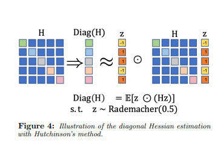

# Optimal Brain Damage

This is a PyTorch implementation of the Optimal Brain Damage algorithm. The algorithm is used to prune the weights of a neural network. The algorithm is based on the paper [Optimal Brain Damage](https://proceedings.neurips.cc/paper_files/paper/1989/file/6c9882bbac1c7093bd25041881277658-Paper.pdf) by Yann LeCun et al.

## Notes / Explanation

The Optimal Brain Damage algorithm is used to prune the weights of a neural network. That is, we first pre-train a neural network, then we prune the weights of the network using the Optimal Brain Damage algorithm. Pruning can be seen as making the weights to 0, or 'cutting' connections.

The paper describes the following way of pruning the weights of a neural network(we assume that it was pretrained, so the loss function is at a local minimum (gradients are 0). In practice that's not exactly true but close enough):

We measure the impact of a parameter perturbation (change) with a Taylor series(imagine we take all the weights of the network and put them in a vector $w$):

$$
\delta E = \sum_{i} g_{i} \delta w_{i} + \frac{1}{2} \sum_{i,j} h_{ij} \delta w_{i} \delta w_{j} + O(\delta w^{3})
$$

where $G$ is the gradient of the loss function with respect to the weights, and $H$ is the Hessian of the loss function with respect to the weights. The first term is the first order term, and the second term is the second order term.

We can now separate the second term in two parts, one where $i = j$ and one where $i \neq j$:

$$
\delta E = \sum_{i} g_{i} \delta w_{i} + \frac{1}{2} \sum_{i} h_{ii} \delta w_{i}^{2} + \frac{1}{2} \sum_{i \neq j} h_{ij} \delta w_{i} \delta w_{j} + O(\delta w^{3})
$$

In the paper, they mention that working with the whole Hessian is pretty expensive, so they approximate the Hessian with the diagonal of the Hessian. That is, we only keep the $h_{ii}$ terms.
On the other hand, remember that we assume that we are near a local minimum, so we can neglect the first order term($G$). We also neglect the third order term:

$$
\delta E = \frac{1}{2} \sum_{i} h_{ii} \delta w_{i}^{2}
$$

It is also assumed that each weight changes the error independently of the other weights, so we can approximate the error change with respect to an individual weight as:

$$
\delta E_{w_{i}} = \frac{1}{2} h_{ii} \delta w_{i}^{2}
$$

Remember that our objective is to 'delete' the weight (connection), so we can set $\delta w_{i} = -w_{i}$.

That is, the effect of deleting a weight is:

$$
\delta E_{w_{i}} = \frac{1}{2} h_{ii} w_{i}^{2}
$$

In the paper, it is called the saliency of the weight.

Then, our objective is to minimize the error change when deleting a weight. In order to do that, we can compute the saliency of each weight, take the smallest one, and make the corresponding weight to 0.

As debscribed on the paper, the complete OBD procedure is:

1. Choose a reasonable network architecture
2. Train the network until a reasonable solution is obtained
3. Compute the second derivatives $h_{ii}$ for each parameter
4. Compute the saliencies for each parameter: $S_{i} = h_{ii} w_{i}^{2}$
5. Sort the parameters by saliency and delete some low-saliency parameters
6. Iterate to step 2

That is, we first pretrain and then iterate over the OBD procedure, each time having more total weights pruned(set to 0).

## PyTorch Implementation

PyTorch provides a native way of computing the Hessian of the loss function with respect to the weights, but it's pretty expensive memory wise. Since we are interested only in the diagonal of the Hessian, we can approximate the diagonal of the Hessian using the following code:

```python

    # df/dw (Jacobian-vector products)
    grads = torch.autograd.grad(loss, model.parameters(), create_graph=True)

    rademacher_zs = [((torch.rand(g.shape) < 0.5).float() * 2 - 1) for g in grads] # rademacher random variables, because we need to sample from {-1, 1}

    # Hessian-vector product
    grads2 = torch.autograd.grad(
        grads,
        model.parameters(),
        grad_outputs=rademacher_zs,
    )

    hessian_diags = [g2 * z for g2, z in zip(grads2, rademacher_zs)]

    hessdiag = torch.cat([h.view(-1) for h in hessian_diags])

    saliencies = (
        hessdiag
        * (
            torch.cat([param.contiguous().view(-1) for param in model.parameters()])
            ** 2
        )
        / 2
    )
```

This is an approximation of the Hessian diagonal, which we use to compute the saliency of each weight. The details can be found on the code.
The approximation implementation follows the details mentioned in [the AdaHessian paper](https://arxiv.org/pdf/2006.00719).



To compute the estimation, we could simply sample different times the diagonal of the Hessian and average the results, but in practice, form efficiency reasons, we only sample once, and it works
pretty much the same way in this case.

## Experiments and results

Initially, we have the following model:

```python
class SimpleModel(torch.nn.Module):
    def __init__(self):
        super(SimpleModel, self).__init__()
        self.fc1 = torch.nn.Linear(784, 128)
        self.fc2 = torch.nn.Linear(128, 10)

    def forward(self, x):
        x = x.view(-1, 784)
        x = torch.relu(self.fc1(x))
        x = self.fc2(x)
        return x

```

It has a total of 101770 parameters. Last experiment was able to remove 75k parameters, yielding a model with 25k parameters. The model was able to achieve 97% accuracy on the MNIST dataset.
Further elimination of parameters would lead to a decrease in accuracy.

## Citations / References

```bibtex
@inproceedings{NIPS1989_6c9882bb,
        author = {LeCun, Yann and Denker, John and Solla, Sara},
        booktitle = {Advances in Neural Information Processing Systems},
        editor = {D. Touretzky},
        pages = {},
        publisher = {Morgan-Kaufmann},
        title = {Optimal Brain Damage},
        url = {https://proceedings.neurips.cc/paper_files/paper/1989/file/6c9882bbac1c7093bd25041881277658-Paper.pdf},
        volume = {2},
        year = {1989}
}
```

```bibtex
@misc{yao2021adahessian,
      title={ADAHESSIAN: An Adaptive Second Order Optimizer for Machine Learning},
      author={Zhewei Yao and Amir Gholami and Sheng Shen and Mustafa Mustafa and Kurt Keutzer and Michael W. Mahoney},
      year={2021},
      eprint={2006.00719},
      archivePrefix={arXiv},
      primaryClass={cs.LG}
}
```
